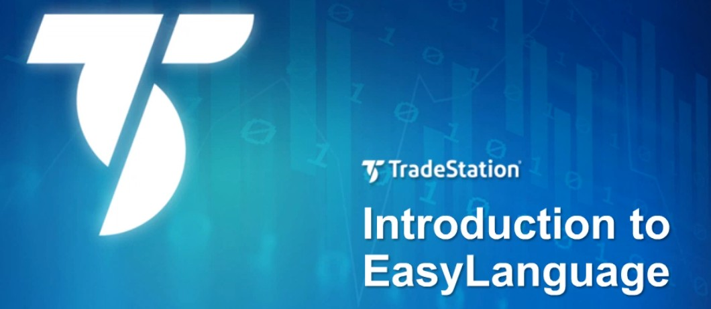
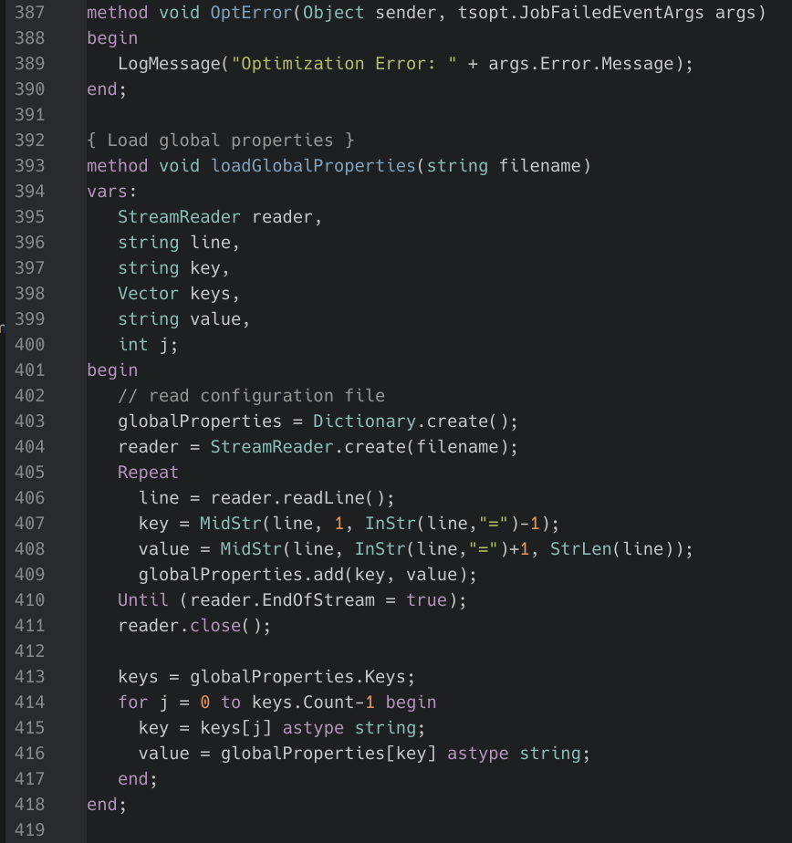
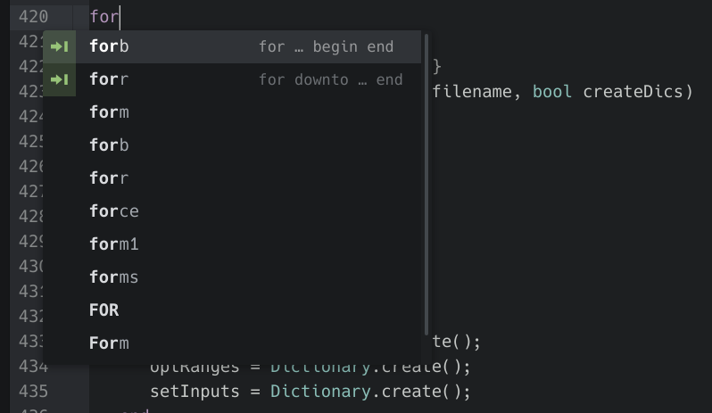

   
  

# Easylanguage TradeStation Support for Atom

**Atom-Language-Easylanguage** is an open source package created for **Atom**.

It provides support for the **Easylanguage** implemented by platforms **Tradestation** and **Multicharts** (Powerlanguage).

* [en.wikipedia.org/wiki/EasyLanguage](https://en.wikipedia.org/wiki/EasyLanguage)
* [introduction-to-easylanguag](https://www.tradestation.com/learn/using-tradestation/tradestation-desktop/courses/introduction-to-easylanguage/)
* [EasyLanguage-Essentials (PDF)](https://uploads.tradestation.com/uploads/EasyLanguage-Essentials.pdf)

Here are some of the features that **Easylanguage for Atom**  provides:

* **Syntax and Grammar Highlighting** for files, forms and projects
* Set of **Snippets**
* **File Symbols** navigation

# Usage

## Grammar Processing and Sytanx Highlighting

Full syntax highlight for **Easylanguage**. Default for files with file-extension `*.eld`. Or press `ctrl+shift+l` and select easylanguage.

Syntax Highlighting is separate project because source highlighting can be different by selected colorscheme. Recommended is atom package [`easylanguage-syntax`](https://github.com/raven2cz/easylanguage-syntax) is contains default one dark highlighting.

## Snippets

Set of snippets available. Just type the word, the popup will show.

## File Symbols

Navigate to any method inside **Easylanguage** files: press `ctrl+r`

## Support

While **Easylanguage for Atom** is free and open source, if you find it useful, please consider to [contribute](CONTRIBUTING.md).

---

## License

[MIT](LICENSE.md) &copy; raven2cz
